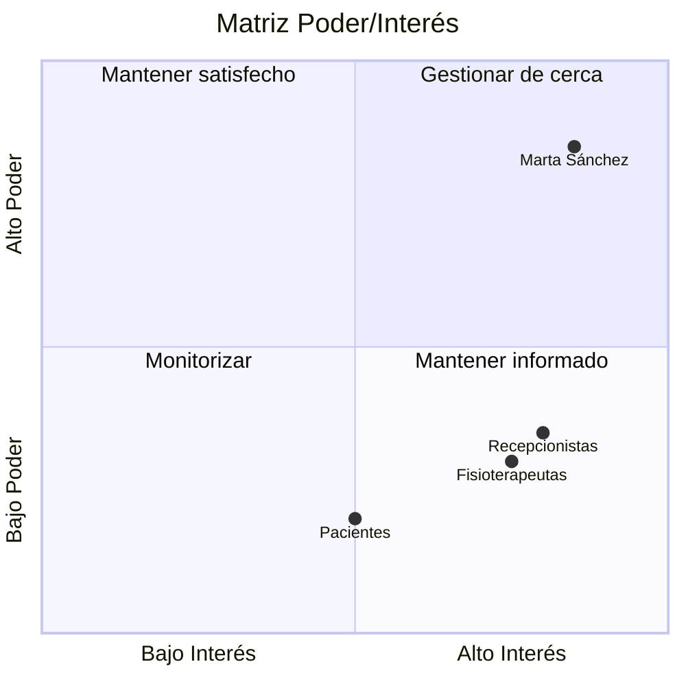

# Registro de interesados
 
| Interesado | Rol/Interés | Poder | Interés | Estrategia |
|---|---|---|---|---|
| Marta Sánchez | Gerente, patrocinadora y único punto de contacto estratégico | Alto | Alto | Gestionar de cerca |
| Ana (Administradora)| Gestión del día a día operativo de las clínicas | Medio | Alto | Gestionar de cerca |
| Fisioterapeutas (15) | Usuarios finales (Introducción de datos) | Bajo | Alto | Mantener informados |
| Recepcionistas (8) | Usuarias finales (Alta resistencia al cambio / 20 años en papel) | Bajo | Alto | Mantener informados / Formar |
| Pacientes (600) | Beneficiarios directos del sistema de citas | Bajo | Medio | Monitorizar |

## Matriz de Poder e Interés

