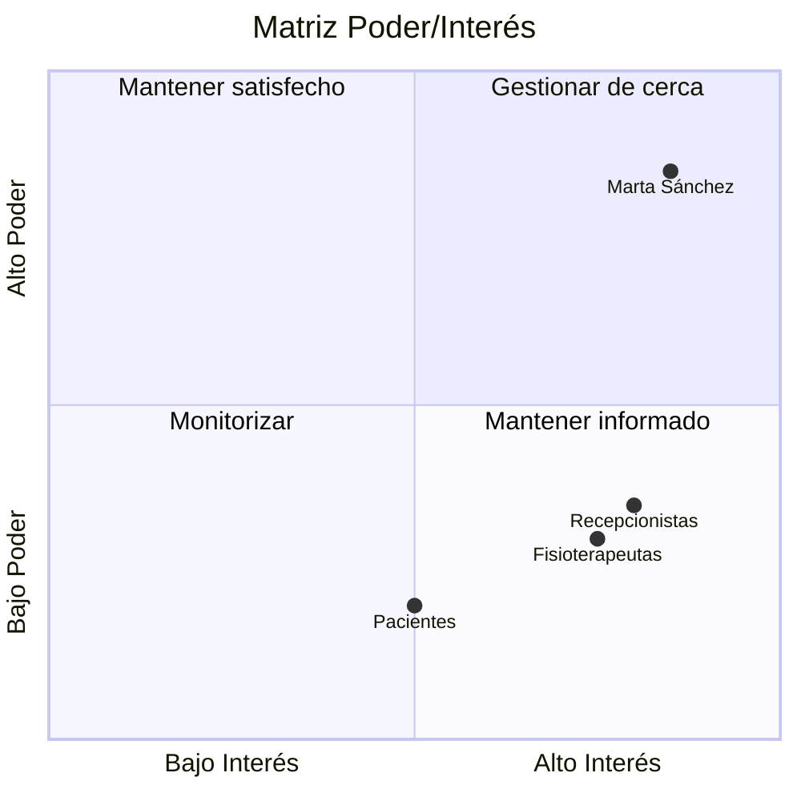

# Registro de interesados
 
| Interesado | Rol/Interés | Poder | Interés | Estrategia |
|---|---|---|---|---|
| Marta Sánchez | Gerente, patrocinadora | Alto | Alto | Gestionar de cerca |
| Fisioterapeutas | Usuarios finales | Bajo | Alto | Mantener informados |
| Recepcionistas | Usuarias finales | Bajo | Alto | Mantener informados |
| Pacientes | Beneficiarios | Bajo | Medio | Monitorizar |

## Matriz de Poder e Interés

