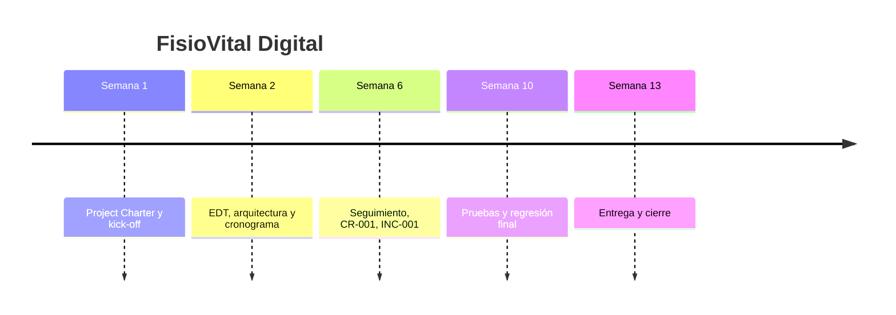

# Postmortem — FisioVital Digital
 
## Resumen ejecutivo
El incidente INC-001 expuso una debilidad en la gestión de versiones entre el desarrollo Backend y el entorno de CI/CD de DevOps. Aunque el fallo fue resuelto rápidamente, dejó claro que la coordinación de dependencias y la validación de entornos son factores críticos en proyectos con requisitos de seguridad RGPD.
 
## Línea temporal

 
## Qué funcionó bien
- El pipeline CI/CD detectó el fallo de inmediato y permitió cortar el despliegue antes de que afectara producción.
- El equipo de DevOps y Backend colaboró rápidamente para aislar el problema y aplicar la corrección en la misma sesión.
- La documentación y comunicación del incidente permitieron cerrar INC-001 sin impacto adicional en los demás módulos.
 
## Qué no funcionó: análisis de causa raíz (5 porqués) de INC-001
1. ¿Por qué se cayó el entorno de pre-producción? Porque el pipeline CI/CD falló durante la ejecución de las pruebas automatizadas y detuvo el despliegue.
2. ¿Por qué falló el pipeline CI/CD al ejecutar las pruebas automatizadas? Porque el entorno de contenedores en la nube usaba una versión antigua de la librería de cifrado que era incompatible con el código Backend.
3. ¿Por qué el entorno de contenedores en la nube no coincidía con la versión de la librería usada en Backend? Porque la actualización de la librería de cifrado se hizo localmente en Backend para cumplir el requisito RGPD, pero no se sincronizó con la imagen de contenedor del pipeline.
4. ¿Por qué no se sincronizó la actualización de la librería de cifrado entre Backend y el pipeline? Porque no existía un proceso automatizado de bloqueo de dependencias ni una validación de compatibilidad de versiones entre el código y la imagen de despliegue.
5. ¿Por qué no existía ese proceso automatizado de bloqueo de dependencias? Porque el equipo había priorizado la entrega funcional y la protección de datos sobre la madurez del pipeline, y no se había incorporado la validación de versiones como parte obligatoria de la fase de integración continua.
**Causa raíz:** Falta de control automatizado de compatibilidad de dependencias entre el desarrollo Backend y el entorno de contenedores CI/CD, lo que permitió que una actualización crítica de seguridad RGPD se desplegara en un entorno con versiones inconsistentes.
 
## Impacto de la arquitectura monolítica modular en el cierre
La arquitectura monolítica modular ayudó a contener el impacto del incidente porque el fallo se limitó al pipeline y al subsistema de cifrado, sin propagarse a las funcionalidades de citas o informes. Sin embargo, el hecho de basar varios módulos en un único conjunto compartido de librerías aumentó el riesgo de incompatibilidades si no se gestionan bien las versiones.
 
## Recomendaciones
- Para el equipo: implementar lockfiles y un escaneo automático de dependencias en el pipeline CI/CD, de modo que cualquier discrepancia de versiones bloquee el despliegue antes de llegar al entorno de pruebas.
- Para la organización: formalizar una política de control de versiones de dependencias para todos los entornos (desarrollo, pre-producción y producción) y exigir validación de compatibilidad en cada cambio que afecte a librerías de seguridad o RGPD.
- Para futuros proyectos: incluir una revisión de coherencia de entorno como hito de QA en la fase de ejecución para reducir la probabilidad de fallos similares en subsistemas críticos.
